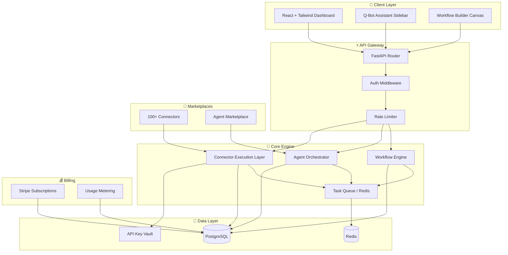

# Q-Empire Mermaid OS — Architecture Blueprint

**Version:** 1.0 — Self-Service Automation Platform
**Author:** Q-Empire Automation Division
**Theme:** Mermaid Queen aesthetic (electric blue, neon aqua, hot pink, gold)

---

## 1. System Architecture (Mermaid.js)



---

## 2. Database Schema

See `backend/migrations/001_mermaid_os_schema.sql` for the full PostgreSQL schema.

Key tables:
- `tenants` — multi-tenant isolation
- `users` — customer accounts
- `subscriptions` — Stripe plans
- `connectors` — connector catalog
- `connector_credentials` — encrypted API keys
- `workflows` — visual workflow definitions
- `workflow_runs` — execution history
- `agents` — AI agent definitions
- `agent_memories` — per-customer memory
- `logs` — execution logs

---

## 3. Backend Structure

```
backend/
├── app/
│   ├── main.py              # FastAPI entry point
│   ├── api/
│   │   ├── auth.py          # Auth routes
│   │   ├── connectors.py    # Connector marketplace routes
│   │   ├── workflows.py     # Workflow CRUD + execution
│   │   ├── agents.py        # Agent marketplace + custom agents
│   │   ├── billing.py       # Stripe billing routes
│   │   └── webhooks.py      # External webhooks
│   ├── connectors/          # Connector framework + 100+ connectors
│   ├── workflows/           # Workflow engine
│   ├── agents/              # Agent framework
│   ├── core/                # Config, security, logging
│   ├── models/              # Pydantic/SQLAlchemy models
│   ├── services/            # Business logic
│   ├── tasks/               # Background task workers
│   └── utils/               # Helpers
├── tests/
└── migrations/
```

---

## 4. Frontend Structure

```
frontend/src/
├── App.tsx
├── components/
│   ├── ui/                  # Buttons, cards, modals
│   ├── workflow/            # Node palette, canvas, Mermaid export
│   ├── connectors/          # Connector cards, config modals
│   ├── agents/              # Agent cards, creation wizard
│   ├── billing/             # Stripe billing components
│   └── dashboard/           # Stats, logs, notifications
├── pages/
│   ├── dashboard/           # Dashboard pages
│   └── ...
├── hooks/                   # Data fetching hooks
├── lib/                     # Constants, helpers
├── types/                   # TypeScript types
└── store/                   # Global state
```

---

## 5. Deployment

- **Frontend:** Vercel
- **Backend API:** Railway
- **Database:** Supabase PostgreSQL
- **Cache/Queue:** Upstash Redis
- **Secrets:** Railway environment variables

See `docs/MERMAID_OS_DEPLOYMENT.md` for detailed instructions.
