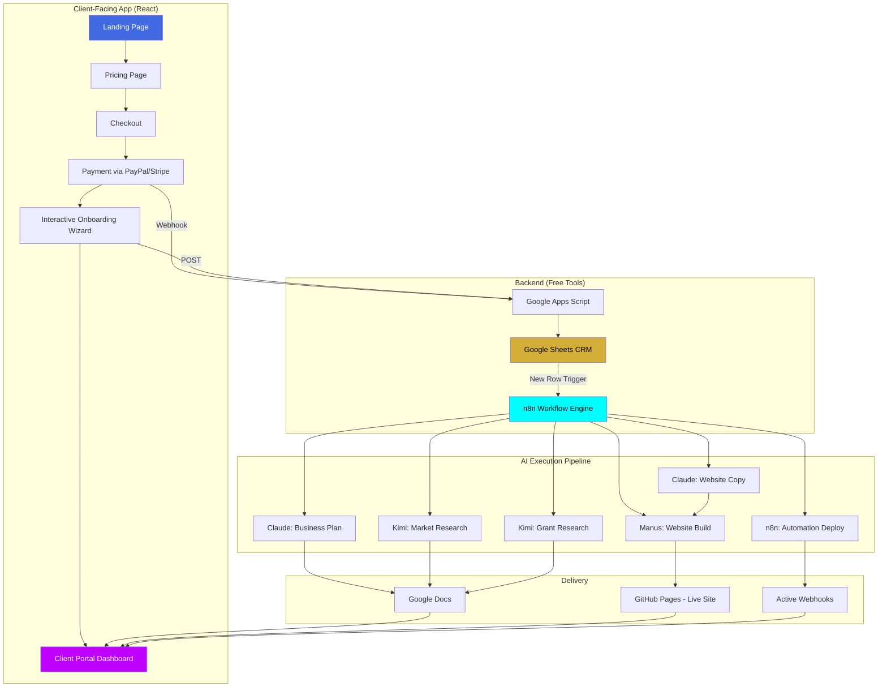

# Q-Empire Self-Service Automation App

## Complete Architecture & GitHub Copilot Build Guide

**Version:** 2.0 — Expanded Self-Service Edition  
**Author:** Q-Empire Automation Division  
**Budget:** $0/month (all free tools)

---

## Executive Summary

This document provides the complete architecture for a self-service app where clients select a package, pay, and are then guided through an automated step-by-step process that builds their entire business — website, branding, automations, funding documents — without any manual intervention from Q-Empire staff. The system uses Manus as the central orchestrator, Claude and Kimi as AI workers, Google Workspace as the free database/CRM, and self-hosted n8n as the workflow engine.

---

## How It Works: The Client Journey

The entire experience unfolds in five automated stages:

| Stage | What the Client Sees | What Happens Behind the Scenes |
|-------|---------------------|-------------------------------|
| 1. Browse & Choose | Landing page with 4 pricing tiers | Marketing site (existing qempireai.com) |
| 2. Pay | Secure checkout via PayPal/Stripe link | Payment webhook fires to Google Apps Script |
| 3. Onboard | Interactive wizard collecting business info | Data saved to Google Sheets CRM |
| 4. Watch It Build | Real-time progress dashboard | AI agents (Manus/Claude/Kimi) execute tasks |
| 5. Receive & Launch | Download deliverables, live website URL | Assets deployed to free hosting |

---

## Expanded Route Structure

The app now includes these additional screens beyond the original site:

| Route | Component | Purpose |
|-------|-----------|---------|
| `/checkout/:packageId` | Checkout | Package confirmation + payment |
| `/onboard` | InteractiveOnboarding | Multi-step business info wizard |
| `/client-portal` | ClientPortal | Authenticated delivery dashboard |
| `/client-portal/blueprint` | BlueprintView | Business plan & pitch deck viewer |
| `/client-portal/website` | WebsiteBuilder | Live preview of generated website |
| `/client-portal/automations` | AutomationsView | Active automation status & webhooks |
| `/client-portal/funding` | FundingView | Grant list & application status |
| `/client-portal/support` | SupportChat | AI-powered Q-Bot support |

---

## Stage 1: Package Selection & Checkout

### What Gets Built

A checkout flow that accepts payment and immediately routes the client into the self-service pipeline. No human approval needed.

### Technical Implementation ($0)

**Payment Processing:** Use PayPal Standard buttons (free, no monthly fee — only per-transaction fee) or Stripe Payment Links (free to create, standard processing fees only). Both provide webhooks on successful payment.

**Webhook Handler:** A Google Apps Script deployed as a web app receives the payment confirmation webhook and creates a new client record in the Google Sheets CRM.

### Copilot Prompt: Checkout Page

```
@workspace Create a Checkout page component at /checkout/:packageId.

Requirements:
- Accept a packageId URL parameter (foundation, empire-pro, enterprise, payg)
- Display the selected package details (name, price, features list)
- Show a PayPal "Pay Now" button (use @paypal/react-paypal-js or a simple PayPal hosted button link)
- On successful payment, redirect to /onboard with the packageId and a payment confirmation token
- Use the Q-Empire dark theme: bg-[#0A0A1A], gradient accents from-[#4169E1] to-[#BF00FF]
- Include a "Secure Checkout" badge and a money-back guarantee notice
- Add Framer Motion entrance animation (fade up)
- Show a loading spinner with "Processing your payment..." during the redirect
```

### Google Apps Script: Payment Webhook Receiver

```javascript
function doPost(e) {
  const sheet = SpreadsheetApp.getActiveSpreadsheet().getSheetByName("Payments");
  const data = JSON.parse(e.postData.contents);
  
  sheet.appendRow([
    new Date(),                    // Timestamp
    data.payer_email,              // Client email
    data.package_id,              // Package selected
    data.amount,                  // Amount paid
    data.transaction_id,          // PayPal/Stripe transaction ID
    "PAID",                       // Status
    "",                           // Onboarding status (filled later)
    ""                            // Delivery status (filled later)
  ]);
  
  // Send welcome email via Gmail
  GmailApp.sendEmail(
    data.payer_email,
    "Welcome to Q-Empire! Your Empire Buildout Starts Now",
    "",
    {
      htmlBody: getWelcomeEmailHTML(data.package_id),
      name: "Q-Empire Automation"
    }
  );
  
  return ContentService.createTextOutput(JSON.stringify({status: "success"}))
    .setMimeType(ContentService.MimeType.JSON);
}
```

---

## Stage 2: Interactive Onboarding Wizard

### What Gets Built

A beautiful multi-step form that collects everything the AI agents need to build the client's business. The wizard adapts based on which package was purchased.

### Steps by Package

| Step | Foundation | Empire Pro | Enterprise | Pay-As-You-Go |
|------|-----------|-----------|-----------|---------------|
| 1. Business Basics | Name, industry, target audience | Same | Same | Same |
| 2. Brand Identity | Color preferences, tone | Same + logo brief | Same + full brand guide | Only if Branding Kit selected |
| 3. Website Brief | 3-page structure | 5-7 page structure + app wireframe | Custom requirements | Only if Website selected |
| 4. Automation Needs | Pick 3 from list | Pick 10 from list | Custom workflow description | Pick selected modules |
| 5. Funding Goals | Revenue target, timeline | Same + investor type preferences | N/A | Only if Funding Package selected |
| 6. Review & Launch | Confirm all inputs | Same | Same | Same |

### Copilot Prompt: Onboarding Wizard

```
@workspace Create an InteractiveOnboarding component at /onboard with a multi-step wizard.

Requirements:
- Use react-hook-form with zod validation for each step
- Steps: BusinessBasics, BrandIdentity, WebsiteBrief, AutomationNeeds, FundingGoals, ReviewAndLaunch
- Show a progress bar at the top with step indicators (numbered circles connected by lines)
- Each step should animate in with Framer Motion (slide from right)
- Include a floating Q-Bot chat assistant on the right side that provides contextual help
- The wizard should adapt based on the packageId (show/hide steps based on what's included)
- On the final step, show a summary of all inputs and a "Launch My Empire" button
- When submitted, POST to a Google Apps Script webhook URL (stored in env var)
- After submission, show an animated success screen: "Q-Bot is building your empire..." with a pulsing animation and redirect to /client-portal after 3 seconds

Step 1 - Business Basics fields:
- Business Name (required)
- Industry (dropdown: Technology, Health & Wellness, E-commerce, Professional Services, Creative, Education, Food & Beverage, Real Estate, Other)
- Target Audience (textarea)
- Elevator Pitch / Value Proposition (textarea, max 200 chars)
- Current Revenue (dropdown: Pre-revenue, Under $10K/mo, $10K-$50K/mo, $50K-$100K/mo, $100K+/mo)

Step 2 - Brand Identity fields:
- Preferred Colors (color picker or preset palettes)
- Brand Tone (dropdown: Professional, Friendly, Bold, Luxurious, Playful, Minimal)
- Tagline ideas (optional text)
- Upload existing logo (optional file upload)
- Inspiration websites (optional, up to 3 URLs)

Step 3 - Website Brief fields:
- Pages needed (checkboxes: Home, About, Services, Pricing, Contact, Blog, Portfolio, Testimonials)
- Key features (checkboxes: Contact Form, Booking Calendar, Live Chat, Payment Integration, Newsletter Signup)
- Content notes (textarea)
- Domain name (if they have one)

Step 4 - Automation Needs fields:
- Show a grid of automation modules with icons and descriptions
- Each module is a selectable card (highlight when selected)
- Modules: Lead Capture Chatbot, Email Welcome Sequence, Email Follow-up Sequence, CRM Pipeline Setup, Appointment Scheduling, Invoice Automation, Payment Reminders, Monthly Reporting, Social Media Auto-posting, Client Onboarding Flow
- Limit selections based on package (3 for Foundation, 10 for Empire Pro, unlimited for Enterprise)

Step 5 - Funding Goals fields:
- Funding amount needed (slider: $5K to $500K)
- Preferred funding type (checkboxes: Grants, Bank Loans, Angel Investors, VC, Crowdfunding)
- Timeline (dropdown: ASAP, 1-3 months, 3-6 months, 6-12 months)
- Existing revenue documentation (yes/no)

Use the Q-Empire design system throughout: dark bg, gradient buttons, cyan/purple accents.
```

### Google Apps Script: Onboarding Data Receiver

```javascript
function doPost(e) {
  const sheet = SpreadsheetApp.getActiveSpreadsheet().getSheetByName("Onboarding");
  const data = JSON.parse(e.postData.contents);
  
  const rowId = Utilities.getUuid();
  
  sheet.appendRow([
    rowId,
    new Date(),
    data.email,
    data.packageId,
    data.businessName,
    data.industry,
    data.targetAudience,
    data.elevatorPitch,
    data.brandTone,
    data.preferredColors,
    JSON.stringify(data.pagesNeeded),
    JSON.stringify(data.automationsSelected),
    data.fundingAmount,
    JSON.stringify(data.fundingTypes),
    "QUEUED"  // Execution status
  ]);
  
  // Trigger the AI execution pipeline
  triggerBuildPipeline(rowId, data);
  
  return ContentService.createTextOutput(JSON.stringify({status: "success", buildId: rowId}))
    .setMimeType(ContentService.MimeType.JSON);
}

function triggerBuildPipeline(buildId, clientData) {
  // Option A: Trigger n8n webhook
  UrlFetchApp.fetch("YOUR_N8N_WEBHOOK_URL/start-build", {
    method: "post",
    contentType: "application/json",
    payload: JSON.stringify({ buildId, ...clientData })
  });
  
  // Option B: Use time-based trigger to process queue
  // ScriptApp.newTrigger("processNextBuild").timeBased().after(1000).create();
}
```

---

## Stage 3: Automated Task Execution Engine

### The AI Pipeline

Once onboarding data is submitted, the execution engine processes each deliverable in sequence. The client sees real-time progress on their dashboard.

### Task Execution Order (Foundation Package Example)

| Task # | Deliverable | AI Agent | Input | Output | Duration |
|--------|------------|----------|-------|--------|----------|
| 1 | Market Research | Kimi | Industry + Audience | Google Doc with competitor analysis | ~5 min |
| 2 | Business Plan | Claude | Research + Elevator Pitch | Google Doc (10-page plan) | ~10 min |
| 3 | Pitch Deck | Claude | Business Plan summary | Google Slides (12 slides) | ~8 min |
| 4 | Brand Kit | Manus | Colors + Tone + Industry | Logo concept + color palette PDF | ~5 min |
| 5 | Website Copy | Claude | Business Plan + Brand Tone | Homepage, About, Services copy | ~8 min |
| 6 | Website Build | Manus | Copy + Brand Kit + Pages | Live React site on GitHub Pages | ~15 min |
| 7 | Automation Setup | n8n | Selected automations | Active webhook URLs + instructions | ~10 min |
| 8 | Funding Strategy | Kimi + Claude | Industry + Revenue + Amount | Grant list + application templates | ~12 min |

**Total automated delivery time: approximately 60-90 minutes** (vs. the 30-day manual timeline currently advertised — this becomes a massive competitive advantage).

### n8n Workflow Design (Self-Hosted, Free)

The n8n workflow is triggered by the Google Apps Script webhook and orchestrates the entire build:

```
[Webhook Trigger] 
    → [Switch Node: Package Type]
        → Foundation Branch:
            → [HTTP Request: Call Claude API for Business Plan]
            → [Google Sheets: Update Status to "Business Plan: Complete"]
            → [HTTP Request: Call Claude API for Website Copy]
            → [Google Sheets: Update Status to "Website Copy: Complete"]
            → [HTTP Request: Call Manus API for Website Build]
            → [Google Sheets: Update Status to "Website: Live"]
            → [HTTP Request: Call Kimi for Funding Research]
            → [Google Sheets: Update Status to "Funding Strategy: Complete"]
            → [Gmail: Send "Your Empire is Ready" email]
        → Empire Pro Branch:
            → [All Foundation tasks]
            → [Additional automation provisioning]
            → [App architecture document generation]
        → Pay-As-You-Go Branch:
            → [Only execute selected modules]
```

### Manus Task: Website Generation

When the pipeline reaches the "Website Build" step, Manus receives a structured prompt:

```
Build a professional React website for [Business Name] in the [Industry] industry.

Brand: [Brand Tone], Colors: [Preferred Colors]
Pages: [Selected Pages]
Copy: [Generated Copy from Claude]

Requirements:
- Use Vite + React + Tailwind CSS
- Deploy to GitHub Pages (free hosting)
- Include a contact form that posts to a Google Apps Script webhook
- Include the client's branding throughout
- Make it mobile-responsive
- Add basic SEO meta tags

Return the live URL when deployed.
```

### Automation Provisioning Templates

For each automation the client selects, the system deploys a pre-built n8n workflow template:

| Automation | What It Does | Free Tools Used |
|-----------|-------------|----------------|
| Lead Capture Chatbot | Collects visitor info via embedded chat widget | Tawk.to (free) + Google Sheets |
| Email Welcome Sequence | Sends 3 emails over 7 days to new leads | Google Apps Script + Gmail |
| Email Follow-up Sequence | Re-engages cold leads after 14 days | Google Apps Script + Gmail |
| CRM Pipeline Setup | Tracks leads through stages | Google Sheets + Apps Script dashboard |
| Appointment Scheduling | Lets clients book calls | Calendly free tier |
| Invoice Automation | Generates and sends invoices | Google Docs template + Apps Script |
| Payment Reminders | Follows up on unpaid invoices | Apps Script time trigger + Gmail |
| Monthly Reporting | Auto-generates performance summary | Google Sheets charts + Gmail |
| Social Media Auto-posting | Schedules posts across platforms | Buffer free tier + Apps Script |
| Client Onboarding Flow | Welcomes new clients with docs & next steps | Gmail + Google Drive folder creation |

---

## Stage 4: Client Delivery Dashboard

### What Gets Built

A real-time dashboard where clients can watch their business being built, download completed deliverables, and access their live assets.

### Copilot Prompt: Client Portal Dashboard

```
@workspace Create a ClientPortal component at /client-portal with a sidebar layout.

Requirements:
- Left sidebar with navigation: Overview, Blueprint, Website, Automations, Funding, Support
- Main content area that changes based on selected nav item
- Overview page shows:
  - A greeting: "Welcome back, [Business Name]!"
  - Package badge showing which tier they purchased
  - 4 progress cards in a 2x2 grid:
    1. "Business Blueprint" - circular progress indicator + status text
    2. "Digital Buildout" - circular progress indicator + status text  
    3. "AI Automations" - circular progress indicator + status text
    4. "Funding Strategy" - circular progress indicator + status text
  - Each card uses Framer Motion to animate the progress circle filling
  - Below the grid: "Recent Activity" timeline showing completed tasks with timestamps

- Blueprint page shows:
  - Download buttons for: Business Plan (Google Doc link), Pitch Deck (Google Slides link), Market Research (Google Doc link)
  - Preview embeds of the Google Docs

- Website page shows:
  - Live preview iframe of the generated website
  - "Visit Live Site" button with the deployed URL
  - "Request Changes" button that opens a form

- Automations page shows:
  - Grid of active automations with status indicators (green = active, yellow = pending, gray = not included)
  - Each automation card shows: name, description, webhook URL (if applicable), and a test button
  - "Add More Automations" upsell button for Pay-As-You-Go

- Funding page shows:
  - List of identified grants with application deadlines
  - Application status tracker (Not Started → In Progress → Submitted → Approved/Denied)
  - Download links for prepared application documents

- Support page shows:
  - Embedded Q-Bot AI chat for instant help
  - FAQ section
  - "Schedule a Call" button linking to Calendly

Design system:
- Dark theme: bg-[#0A0A1A]
- Sidebar: bg-[#0a0a0f] with border-r border-[#4169E1]/20
- Active nav item: text-[#00FFFF] with bg-[#4169E1]/10 rounded-lg
- Progress circles: stroke color gradient from #4169E1 to #BF00FF
- Cards: bg-[#1a1a2e]/50 border border-[#4169E1]/20 rounded-2xl
```

### Google Apps Script: Status API for Dashboard

```javascript
function doGet(e) {
  const email = e.parameter.email;
  const sheet = SpreadsheetApp.getActiveSpreadsheet().getSheetByName("BuildStatus");
  const data = sheet.getDataRange().getValues();
  const headers = data[0];
  
  // Find the client's row
  const clientRow = data.find(row => row[headers.indexOf("email")] === email);
  
  if (!clientRow) {
    return ContentService.createTextOutput(JSON.stringify({error: "Not found"}))
      .setMimeType(ContentService.MimeType.JSON);
  }
  
  const response = {
    businessName: clientRow[headers.indexOf("businessName")],
    package: clientRow[headers.indexOf("package")],
    progress: {
      blueprint: clientRow[headers.indexOf("blueprintProgress")] || 0,
      website: clientRow[headers.indexOf("websiteProgress")] || 0,
      automations: clientRow[headers.indexOf("automationsProgress")] || 0,
      funding: clientRow[headers.indexOf("fundingProgress")] || 0
    },
    deliverables: {
      businessPlanUrl: clientRow[headers.indexOf("businessPlanUrl")] || null,
      pitchDeckUrl: clientRow[headers.indexOf("pitchDeckUrl")] || null,
      websiteUrl: clientRow[headers.indexOf("websiteUrl")] || null,
      automationWebhooks: JSON.parse(clientRow[headers.indexOf("automationWebhooks")] || "[]")
    },
    recentActivity: JSON.parse(clientRow[headers.indexOf("activityLog")] || "[]")
  };
  
  return ContentService.createTextOutput(JSON.stringify(response))
    .setMimeType(ContentService.MimeType.JSON);
}
```

---

## Stage 5: Automated Email Sequences

The system sends automated emails at each milestone:

| Trigger | Email Subject | Content |
|---------|-------------|---------|
| Payment confirmed | "Welcome to Q-Empire! Your Buildout Starts Now" | Package details, what to expect, link to onboarding wizard |
| Onboarding complete | "Q-Bot Has Started Building Your Empire" | Confirmation of inputs, estimated timeline, link to dashboard |
| Business plan ready | "Your Business Blueprint is Complete" | Download link, key highlights, next steps |
| Website live | "Your Website is LIVE!" | Live URL, screenshot preview, how to share |
| Automations active | "Your AI Automations Are Running 24/7" | List of active automations, how to test them |
| Funding strategy ready | "Your Funding Roadmap is Ready" | Grant list, application deadlines, next steps |
| All complete | "Your Empire is Built. Time to Dominate." | Summary of everything delivered, upsell to next tier |

---

## Complete Updated File Structure

```
qempire-app/
├── package.json
├── vite.config.ts
├── tailwind.config.ts
├── tsconfig.json
├── index.html
├── public/
│   └── assets/
│       ├── hero_michelle.png
│       ├── automation_flow_diagram.png
│       ├── brand_logo.png
│       └── qbot_avatar.png
├── src/
│   ├── main.tsx
│   ├── App.tsx
│   ├── index.css
│   ├── lib/
│   │   ├── utils.ts (cn helper, etc.)
│   │   ├── api.ts (Google Apps Script API calls)
│   │   └── constants.ts (package definitions, module list)
│   ├── contexts/
│   │   ├── ThemeContext.tsx
│   │   └── AuthContext.tsx (client session management)
│   ├── hooks/
│   │   ├── useClientData.ts (fetch client build status)
│   │   └── useOnboarding.ts (multi-step form state)
│   ├── components/
│   │   ├── Navigation.tsx
│   │   ├── Footer.tsx
│   │   ├── AIChatAssistant.tsx (Q-Bot floating chat)
│   │   ├── FAQSection.tsx
│   │   ├── ImageCarousel.tsx
│   │   ├── CalendarBooking.tsx
│   │   ├── ProgressCircle.tsx (animated circular progress)
│   │   ├── StepIndicator.tsx (wizard step progress bar)
│   │   ├── DeliverableCard.tsx (download/preview card)
│   │   ├── AutomationCard.tsx (automation status card)
│   │   ├── PackageCard.tsx (pricing tier card)
│   │   ├── ErrorBoundary.tsx
│   │   └── ui/
│   │       ├── button.tsx
│   │       ├── card.tsx
│   │       ├── checkbox.tsx
│   │       ├── input.tsx
│   │       ├── select.tsx
│   │       ├── textarea.tsx
│   │       ├── tooltip.tsx
│   │       ├── progress.tsx
│   │       └── sonner.tsx
│   └── pages/
│       ├── Home.tsx
│       ├── About.tsx
│       ├── Services.tsx
│       ├── UseCases.tsx
│       ├── Pricing.tsx
│       ├── CaseStudies.tsx
│       ├── Investors.tsx
│       ├── Resources.tsx
│       ├── Careers.tsx
│       ├── Apply.tsx
│       ├── Booking.tsx
│       ├── Checkout.tsx ← NEW
│       ├── InteractiveOnboarding.tsx ← EXPANDED
│       │   ├── steps/
│       │   │   ├── BusinessBasics.tsx
│       │   │   ├── BrandIdentity.tsx
│       │   │   ├── WebsiteBrief.tsx
│       │   │   ├── AutomationNeeds.tsx
│       │   │   ├── FundingGoals.tsx
│       │   │   └── ReviewAndLaunch.tsx
│       ├── ClientPortal.tsx ← NEW
│       │   ├── views/
│       │   │   ├── Overview.tsx
│       │   │   ├── BlueprintView.tsx
│       │   │   ├── WebsiteView.tsx
│       │   │   ├── AutomationsView.tsx
│       │   │   ├── FundingView.tsx
│       │   │   └── SupportChat.tsx
│       ├── TeamPortal.tsx
│       ├── AdminDashboard.tsx
│       └── NotFound.tsx
├── backend/ (Google Apps Script files)
│   ├── payment-webhook.gs
│   ├── onboarding-receiver.gs
│   ├── status-api.gs
│   ├── email-sequences.gs
│   └── build-trigger.gs
└── n8n-workflows/ (importable JSON)
    ├── foundation-build-pipeline.json
    ├── empire-pro-build-pipeline.json
    ├── automation-lead-capture.json
    ├── automation-email-welcome.json
    ├── automation-invoice.json
    ├── automation-scheduling.json
    └── automation-reporting.json
```

---

## Updated App.tsx Router

```tsx
import { Switch, Route } from "wouter";
import { AuthProvider } from "./contexts/AuthContext";

// Public pages
import Home from "./pages/Home";
import Services from "./pages/Services";
import UseCases from "./pages/UseCases";
import Pricing from "./pages/Pricing";
import About from "./pages/About";
import CaseStudies from "./pages/CaseStudies";
import Investors from "./pages/Investors";
import Resources from "./pages/Resources";
import Careers from "./pages/Careers";
import Apply from "./pages/Apply";
import Booking from "./pages/Booking";
import NotFound from "./pages/NotFound";

// Self-service flow
import Checkout from "./pages/Checkout";
import InteractiveOnboarding from "./pages/InteractiveOnboarding";
import ClientPortal from "./pages/ClientPortal";

// Internal
import TeamPortal from "./pages/TeamPortal";
import AdminDashboard from "./pages/AdminDashboard";

function App() {
  return (
    <AuthProvider>
      <Switch>
        {/* Public Marketing Pages */}
        <Route path="/" component={Home} />
        <Route path="/services" component={Services} />
        <Route path="/use-cases" component={UseCases} />
        <Route path="/pricing" component={Pricing} />
        <Route path="/about" component={About} />
        <Route path="/case-studies" component={CaseStudies} />
        <Route path="/investors" component={Investors} />
        <Route path="/resources" component={Resources} />
        <Route path="/careers" component={Careers} />
        <Route path="/apply" component={Apply} />
        <Route path="/booking" component={Booking} />

        {/* Self-Service Pipeline */}
        <Route path="/checkout/:packageId" component={Checkout} />
        <Route path="/onboard" component={InteractiveOnboarding} />
        <Route path="/client-portal" component={ClientPortal} />
        <Route path="/client-portal/:view" component={ClientPortal} />

        {/* Internal */}
        <Route path="/team-portal" component={TeamPortal} />
        <Route path="/admin" component={AdminDashboard} />
        <Route path="/404" component={NotFound} />
        <Route component={NotFound} />
      </Switch>
    </AuthProvider>
  );
}

export default App;
```

---

## Package Definitions (constants.ts)

```typescript
export interface PackageDefinition {
  id: string;
  name: string;
  price: string;
  priceNumeric: number;
  billing: string;
  description: string;
  features: string[];
  maxAutomations: number;
  maxPages: number;
  includesBlueprint: boolean;
  includesFunding: boolean;
  includesWebsite: boolean;
  onboardingSteps: string[];
}

export const PACKAGES: PackageDefinition[] = [
  {
    id: "foundation",
    name: "Foundation Launchpad",
    price: "$1,997",
    priceNumeric: 1997,
    billing: "one-time",
    description: "Perfect for solopreneurs starting out",
    features: [
      "Business plan & pitch deck",
      "3-page professional website",
      "3 AI automations",
      "Initial funding strategy",
      "Email support (24-48 hrs)"
    ],
    maxAutomations: 3,
    maxPages: 3,
    includesBlueprint: true,
    includesFunding: true,
    includesWebsite: true,
    onboardingSteps: ["business-basics", "brand-identity", "website-brief", "automation-needs", "funding-goals", "review"]
  },
  {
    id: "empire-pro",
    name: "Empire Builder Pro",
    price: "$4,997",
    priceNumeric: 4997,
    billing: "one-time",
    description: "Full business buildout with aggressive funding",
    features: [
      "Everything in Foundation",
      "Advanced 5-7 page website + app plan",
      "10 AI automations",
      "Full funding activation (grants, loans, VC)",
      "5% success fee on funding over $50K",
      "Launch & scale strategy",
      "Priority support (12-24 hrs)"
    ],
    maxAutomations: 10,
    maxPages: 7,
    includesBlueprint: true,
    includesFunding: true,
    includesWebsite: true,
    onboardingSteps: ["business-basics", "brand-identity", "website-brief", "automation-needs", "funding-goals", "review"]
  },
  {
    id: "enterprise",
    name: "Enterprise AI",
    price: "$15K+",
    priceNumeric: 15000,
    billing: "custom",
    description: "Custom AI for established businesses",
    features: [
      "Custom AI systems engineering",
      "Multi-agent orchestration",
      "Custom app development & deployment",
      "RAG data infrastructure",
      "Legacy system integration",
      "Dedicated project manager",
      "Monthly retainer ($2.5K-$15K)",
      "24/7 support + GDPR/HIPAA compliance"
    ],
    maxAutomations: 999,
    maxPages: 999,
    includesBlueprint: true,
    includesFunding: false,
    includesWebsite: true,
    onboardingSteps: ["business-basics", "brand-identity", "website-brief", "automation-needs", "review"]
  },
  {
    id: "payg",
    name: "Pay-As-You-Go",
    price: "$250+",
    priceNumeric: 250,
    billing: "per module",
    description: "Build incrementally as you grow",
    features: [
      "Individual modules ($250-$3K each)",
      "Business plan, website, automations",
      "Funding packages, chatbots, dashboards",
      "Flexible pricing & no commitment",
      "Combine modules as needed",
      "Email support"
    ],
    maxAutomations: 999,
    maxPages: 999,
    includesBlueprint: false,
    includesFunding: false,
    includesWebsite: false,
    onboardingSteps: ["business-basics", "module-selection", "review"]
  }
];

export const AUTOMATION_MODULES = [
  { id: "lead-chatbot", name: "Lead Capture Chatbot", description: "Q-Bot qualifies leads and collects info 24/7", icon: "MessageSquare", price: 1000 },
  { id: "email-welcome", name: "Email Welcome Sequence", description: "3-email series sent to new leads over 7 days", icon: "Mail", price: 500 },
  { id: "email-followup", name: "Email Follow-up Sequence", description: "Re-engage cold leads after 14 days", icon: "MailPlus", price: 500 },
  { id: "crm-pipeline", name: "CRM Pipeline Setup", description: "Track leads through stages in a visual dashboard", icon: "Kanban", price: 750 },
  { id: "scheduling", name: "Appointment Scheduling", description: "Clients book directly into your calendar", icon: "Calendar", price: 250 },
  { id: "invoice", name: "Invoice Automation", description: "Generate and send invoices automatically", icon: "Receipt", price: 500 },
  { id: "payment-reminders", name: "Payment Reminders", description: "Follow up on unpaid invoices automatically", icon: "Bell", price: 500 },
  { id: "reporting", name: "Monthly Reporting", description: "Auto-generated performance summaries", icon: "BarChart3", price: 1000 },
  { id: "social-posting", name: "Social Media Auto-posting", description: "Schedule and publish across platforms", icon: "Share2", price: 500 },
  { id: "client-onboarding", name: "Client Onboarding Flow", description: "Welcome new clients with docs & next steps", icon: "UserPlus", price: 500 }
];

export const PAYG_MODULES = [
  { id: "business-plan", name: "Business Plan", price: 500 },
  { id: "pitch-deck", name: "Pitch Deck", price: 350 },
  { id: "website-3page", name: "3-Page Website", price: 1500 },
  { id: "branding-kit", name: "Branding Kit", price: 750 },
  { id: "ai-chatbot", name: "AI Chatbot", price: 1000 },
  { id: "email-automation", name: "Email Automation (5 sequences)", price: 500 },
  { id: "crm-setup", name: "CRM Setup", price: 750 },
  { id: "scheduling-system", name: "Scheduling System", price: 250 },
  { id: "invoice-automation", name: "Invoice Automation", price: 500 },
  { id: "reporting-dashboard", name: "Reporting Dashboard", price: 1000 },
  { id: "funding-package", name: "Funding Package (Grants)", price: 2000 },
  { id: "social-media-setup", name: "Social Media Setup", price: 500 }
];
```

---

## Zero-Cost Technology Stack Summary

Every component of this system runs at $0/month:

| Component | Free Tool | What It Replaces |
|-----------|-----------|-----------------|
| Database/CRM | Google Sheets | Airtable, HubSpot ($45/mo+) |
| Backend Logic | Google Apps Script | AWS Lambda, Vercel Functions |
| Workflow Engine | Self-hosted n8n (Docker) | Zapier ($20/mo+), Make ($9/mo+) |
| AI Content Generation | Claude Free / Kimi Free | ChatGPT Plus ($20/mo) |
| Orchestration | Manus | Custom dev team |
| Email Sending | Gmail (via Apps Script) | Mailchimp ($13/mo+), SendGrid |
| Website Hosting | GitHub Pages / Cloudflare Pages | Vercel Pro, Netlify Pro |
| Scheduling | Calendly Free Tier | Acuity ($16/mo+) |
| Live Chat | Tawk.to (free) | Intercom ($74/mo+) |
| Payment Processing | PayPal Standard / Stripe Links | Shopify ($29/mo+) |
| File Storage | Google Drive | AWS S3, Dropbox Business |
| Version Control | GitHub (free private repos) | GitLab Premium |

---

## How to Build This with GitHub Copilot: Step-by-Step

1. **Initialize the project** using the file structure above.
2. **Feed Copilot the design system** (colors, fonts, component patterns from the original architecture doc).
3. **Generate the Checkout page** using Prompt 1.
4. **Generate the Onboarding Wizard** using Prompt 2 — this is the most complex component.
5. **Generate the Client Portal** using Prompt 3.
6. **Set up Google Apps Script** using the code snippets above (deploy as web apps).
7. **Configure n8n workflows** to connect the pipeline.
8. **Test the full flow**: Select package → Pay → Onboard → Watch dashboard update → Receive deliverables.

---

## Architecture Diagram (Mermaid)



This diagram can be rendered using `manus-render-diagram` or pasted into any Mermaid-compatible viewer.
